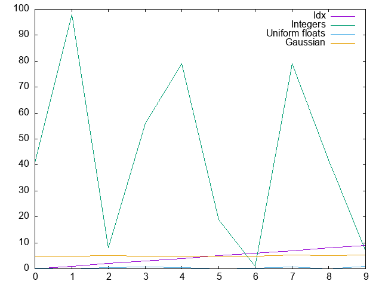
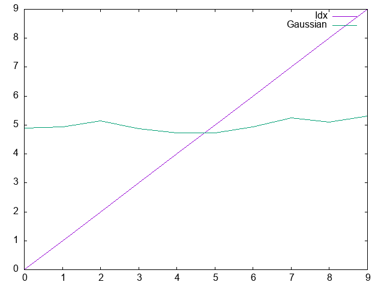
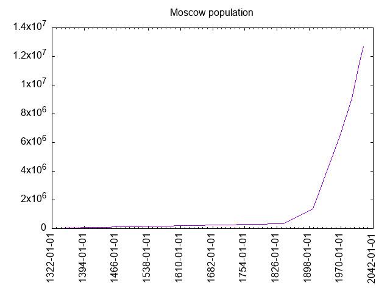

I want you to meet Teddy. Teddy wanna be like pandas. Pandas are cool. Teddy want be cool too!


# Reasoning

This library provides some Common Lisp facitilies to work with data frames.

Common Lisp already has [numcl](https://github.com/numcl/numcl) to operate on arrays, and now we need
a more abstract tool to work with data like data sheets.

Teddy make it possible to define a dataframe full of data, to slice it in different ways, to join data frames
and see some statistics about the data.

This is a proof of the concept and API will be changed. Check the
[ChangeLog.md](ChangeLog.md) to learn about new abilities and refactoring details.

# How to create a data-frame

Here is how we can create a simple data-frame:

```lisp
POFTHEDAY> (teddy/data-frame:make-data-frame
            '("Idx" "Integers" "Uniform floats" "Gaussian")
            :rows
            (loop repeat 10
                  for idx upfrom 0
                  collect (list idx
                                (random 100)
                                (random 1.0)
                                (statistics:random-normal
                                 :mean 5.0
                                 :sd 0.2))))
+-----+----------+----------------+----------+
| Idx | Integers | Uniform floats | Gaussian |
+-----+----------+----------------+----------+
|   0 |       41 |           0.27 |   4.89d0 |
|   1 |       98 |           0.08 |   4.93d0 |
|   2 |        8 |           0.45 |   5.15d0 |
|   3 |       56 |           0.63 |   4.87d0 |
|   4 |       79 |           0.42 |   4.72d0 |
|   5 |       19 |           0.04 |   4.73d0 |
|   6 |        1 |           0.34 |   4.93d0 |
|   7 |       79 |           0.60 |   5.25d0 |
|   8 |       42 |           0.08 |   5.10d0 |
|   9 |        7 |           0.86 |   5.31d0 |
+-----+----------+----------------+----------+
```

# Data manipulation

Now we can slice it by columns, rows or both:

```lisp
POFTHEDAY> (teddy/data-frame:head *d* 2)
+-----+----------+----------------+----------+
| Idx | Integers | Uniform floats | Gaussian |
+-----+----------+----------------+----------+
|   0 |       41 |           0.27 |   4.89d0 |
|   1 |       98 |           0.08 |   4.93d0 |
+-----+----------+----------------+----------+
POFTHEDAY> (teddy/data-frame:tail *d* 2)
+-----+----------+----------------+----------+
| Idx | Integers | Uniform floats | Gaussian |
+-----+----------+----------------+----------+
|   8 |       42 |           0.08 |   5.10d0 |
|   9 |        7 |           0.86 |   5.31d0 |
+-----+----------+----------------+----------+
POFTHEDAY> (teddy/data-frame:slice
            *d*
            :columns '("idx" "gaussian"))
+-----+----------+
| Idx | Gaussian |
+-----+----------+
|   0 |   4.89d0 |
|   1 |   4.93d0 |
|   2 |   5.15d0 |
|   3 |   4.87d0 |
|   4 |   4.72d0 |
|   5 |   4.73d0 |
|   6 |   4.93d0 |
|   7 |   5.25d0 |
|   8 |   5.10d0 |
|   9 |   5.31d0 |
+-----+----------+
POFTHEDAY> (teddy/data-frame:slice *d*
            :columns '("idx" "gaussian")
            :from 4
            :to 6)
+-----+----------+
| Idx | Gaussian |
+-----+----------+
|   4 |   4.72d0 |
|   5 |   4.73d0 |
+-----+----------+
```

# Analyzing data

Also, we might want to see some descriptive statistical data about our
data frame. This is pretty easy with Teddy:

```lisp
POFTHEDAY> (teddy/stats:stats *d*)
+----------------+--------+--------+--------+--------+--------+-------+-------+---------+
| Column         | Min    | p25    | p50    | p75    | Max    | Mean  | SD    | Sum     |
+----------------+--------+--------+--------+--------+--------+-------+-------+---------+
| Idx            |      0 |      2 |   4.50 |      7 |      9 |  4.50 |  3.03 |      45 |
| Integers       |      1 |      8 |  41.50 |     79 |     98 | 43.00 | 34.40 |     430 |
| Uniform floats |   0.04 |   0.08 |   0.38 |   0.60 |   0.86 |  0.38 |  0.27 |    3.75 |
| Gaussian       | 4.72d0 | 4.87d0 | 4.93d0 | 5.15d0 | 5.31d0 |  4.99 |  0.20 | 49.88d0 |
+----------------+--------+--------+--------+--------+--------+-------+-------+---------+
```

Probably, we can make some extandable protocol to calculate other
properties.

# Iteration over rows

Data frame stores data as columns. Each column is a vector of particular
type. If you want to process a row, you can create an iterator and use
it to go through rows like that:

```lisp
POFTHEDAY> (loop with iterator = (teddy/data-frame:make-iterator *d*)
                 for row = (funcall iterator)
                 while row
                 do (format t "Row: ~S~%"
                            row))
Row: (0 41 0.26806116 4.887522971759381d0)
Row: (1 98 0.081421256 4.928584134866222d0)
Row: (2 8 0.45165908 5.147222819038834d0)
Row: (3 56 0.62647486 4.874349648519968d0)
Row: (4 79 0.41671002 4.7239718274963485d0)
Row: (5 19 0.04152584 4.727268395019779d0)
Row: (6 1 0.3369373 4.93339303609316d0)
Row: (7 79 0.59791017 5.2466443304900965d0)
Row: (8 42 0.076958776 5.103448455243024d0)
Row: (9 7 0.85732913 5.310498824093041d0)

```

# Plotting data

Plotting facilities as rudimentary. All functions related to plotting
are in the `teddy/plot` package. Right now `GNUPlot` is used via
[eazy-gnuplot](http://quickdocs.org/eazy-gnuplot/) library.

Here is how we can plot our data from all columns:

```lisp

POFTHEDAY> (teddy/plot:plot *d*
            "docs/media/0099/simple-plot.png")
```




If we want to plot only gaussian, then it will be wrong, because we need
histogram type of plot. This it "to be done":

```lisp
POFTHEDAY> (teddy/plot:plot
            (teddy/data-frame:slice *d*
                                    :columns '("Idx" "Gaussian"))
            "docs/media/0099/gaussian.png")
```




Another type of plots `Teddy` is able to render right now is a
"timeseries":

```lisp

POFTHEDAY> (defparameter *moscow-population*
             (teddy/data-frame:make-data-frame
              '("Date" "Population")
              :rows '(("1350-01-01" 30000)
                      ("1840-01-01" 349000)
                      ("1907-01-01" 1345700)
                      ("1967-01-01" 6422000)
                      ("1994-01-01" 9066000)
                      ("2010-01-01" 11500000)
                      ("2020-01-01" 12680000))))
*MOSCOW-POPULATION*
POFTHEDAY> (teddy/plot:plot-timeseries
            *moscow-population* "docs/media/0099/moscow2.png"
            :title "Moscow population")
"docs/media/0099/moscow.png"
```




Join the effort to make Teddy really useful for data analysis!

Right now, Teddy installable only from Ultralisp, because it is the best
place to host unstable fast changing Common Lisp libraries.


# Credentials

* Logo is by [JenDigitalArt](https://pixabay.com/users/jendigitalart-6490932/?tab=about), was downloaded [from Pixabay](https://pixabay.com/illustrations/bear-cute-bear-cartoon-adorable-3189349/).
